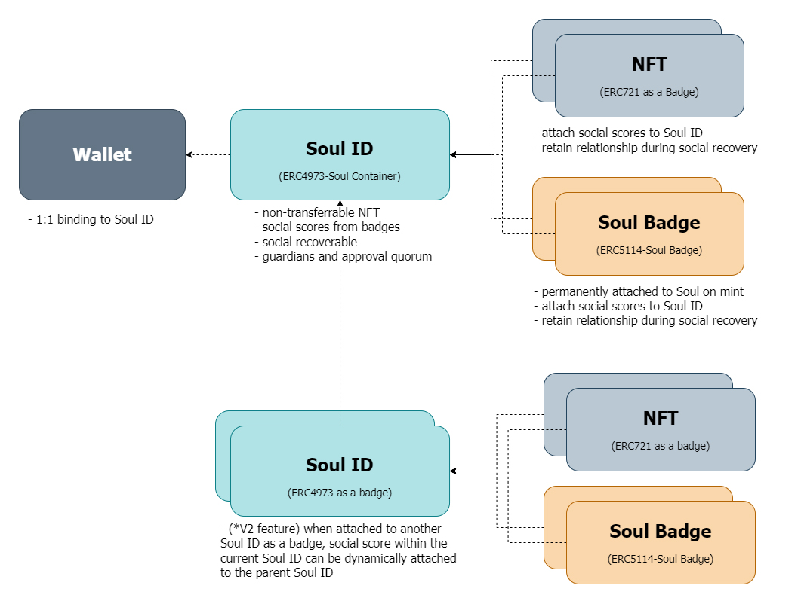

# Sharkz Soulbound V1

[![Issues][issues-shield]][issues-url]
[![MIT License][license-shield]][license-url]
<!-- [![Contributors][contributors-shield]][contributors-url] -->
<!-- [![Forks][forks-shield]][forks-url] -->
<!-- [![Stargazers][stars-shield]][stars-url] -->

This repository contains our implementation of [EIP4973](https://eips.ethereum.org/EIPS/eip-4973), [EIP5114](https://eips.ethereum.org/EIPS/eip-5114), and our final contracts, namely *Soul ID* and *Soul Badge*. By using [Openzeppelin UUPS](https://blog.openzeppelin.com/workshop-recap-deploying-more-efficient-upgradeable-contracts/) upgradeable contract design, our Soulbound Solution features a future-proof product with endless possibilities.

This is the first of its kind [Soulbound](https://vitalik.ca/general/2022/01/26/soulbound.html) application for the NFT space, which is designed and deployed by Sharkz Entertainment.

## UUPS benefits

- Contract data is stored in proxy contract, improvement or bugfix can be done by just deploying new implementation contract.
- When compared to Transparent proxy and Diamond proxy, UUPS is the most gas efficient proxy pattern for token owners.

## Contract design

In the current world of Web3, most people create their social identity with only [EOA wallet](https://ethereum.org/en/glossary/#eoa). However, by design, a wallet is meant to be an asset holder, not an identity holder, it lacks many features for a real-life identity.

Inspired by the concept of [Soulbound](https://vitalik.ca/general/2022/01/26/soulbound.html) discussed by Vitalik Buterin, we build our Soulbound Solution (Soul ID) purely with smart contracts. It provides a socially secured, censorship-free and recoverable identity, allowing identity owner (token owner) to easily store social reputation scores within our NFT ecosystem, we think this technology will help to form the future of [decentralized society](https://papers.ssrn.com/sol3/papers.cfm?abstract_id=4105763), where each separated community identities can inter-exchange social scores by a [common interface](https://github.com/TeamSHARKZ/soulbound/blob/main/contracts/lib/sharkz/IScore.sol), scores can be aggregated into a parent identity and form a society.



Above diagram demonstrates how the contract system works. *Soul ID* is a single Soul identity, it is a custom ERC4973 implementation enforcing 1:1 binding to an EOA wallet address, it can store social scores attached from multiple internal / external badge contracts. Badge contracts support both the ERC721 NFT token and our ERC5114-Soul Badges. Soul Badges are designed to work and mint with Soul ID, without any knowledge of EOA wallet owner, in this way, Soul Badges can be securely and permanently attached to a Soul at mint time, maintaining the relationship during any event of Soul ID relocation or recovery.

## Main features

- Token is binding to one wallet address and acts like a single *Soul and UID*.
- As defined by EIP4973, *Soul ID* implements [ERC721 Metadata interface](https://eips.ethereum.org/EIPS/eip-721) without any ERC721 transfer functions; token meta is viewable on the NFT marketplaces while remaining non-tradable.
- Token includes a dynamic score trait, the value will be increased or decreased by collecting or burning badge token balance.
- Contract admins can link or unlink any supported badge contracts (ERC721, Soul Badge), and scores will be updated.
- Scores will come from all linked badges. For Soul ID v2, we plan to support *Soul ID as a badge*, allowing aggregated scores for every linked *Soul ID* from other communities.
- Token images are 100% on-chain generated, and displaying data is customizable by token owner.
- Token owners can set up guardians; the [approval quorum](https://findhoalaw.com/tag/majority-of-quorum/) can safeguard the identity data from change requests.
- Support token relocation to a new wallet address by the token owner, using the guardian approval workflow.
- Support token social-recovery by other guardians, using the guradian approval workflow.

## Documentation

- [Soulbound V1 Web3 DApp](https://sharkzent.io/soulbound/v1)
- [Soulbound Medium article](https://medium.com/@sharkzent/sharkz-soulbound-101-26b5933edcc9)
- [Soul ID smart contract](https://etherscan.io/address/0x12DEb1Cb5732E40Dd55B89aBB6D5C31dF13A6e38#readProxyContract)
- [Soul Badge smart contract](https://etherscan.io/address/0x43013825FA33C5CC93b3B72AdE12D58fCFF2d712#code)

## Soulbound EIP implementations

### ERC4973 Soul Container

This implementation includes many features for practical usage, by including ERC721 Metadata extension, we allow NFT platforms to recognize the token name, symbol and token metadata, e.g. token image, token traits. By design, transfer related functions, ERC721 transfer, operator, and approval functions are all removed, making it non-transferrable by design.

### ERC5114 Soul Badge

This implementation features a *badge-like* ownership design, token is attached to a Soul ID (ERC4973 token) by linking internal token ID to an external contract address and token number, as a Soul will eventually resolve to a wallet owner, there is no need to have the Soul Badge token to store  wallet address. During a Soul relocation or recovery, the linkage between Soul Badge and Soul ID will be naturally maintained.

## Installation

After downloading the repo, please first install all necessary NPM modules. Copy the `.env-sample` as `.env`, and fill in all API and test keys.

```sh
npm install
npx hardhat test
```

This repo includes both standard and UUPS upgradeable version of ERC4973 related contracts, and our final product, *Soul ID* and *Soul Badge* contracts.

## License

This project is available under the [MIT license](https://opensource.org/licenses/MIT).

<!-- MARKDOWN LINKS & IMAGES -->

<!-- https://www.markdownguide.org/basic-syntax/#reference-style-links -->
[issues-shield]: https://img.shields.io/github/issues/TeamSHARKZ/soulbound.svg?style=for-the-badge
[issues-url]: https://github.com/TeamSHARKZ/soulbound/issues
[license-shield]: https://img.shields.io/badge/License-MIT-green.svg?style=for-the-badge
[license-url]: https://github.com/TeamSHARKZ/soulbound/LICENSE